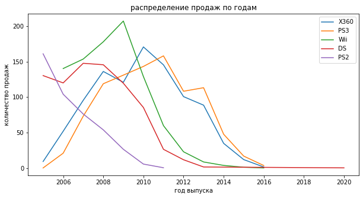

## Анализ исторических данных по продажам компьютерных игр.
### Выявление закономерностей,определяющих успешность игры и прогноз продаж.


```python
import pandas as pd
import numpy as np
import matplotlib.pyplot as plt
import warnings
import seaborn 
from scipy import stats
from pandas.core.common import SettingWithCopyWarning
warnings.simplefilter(action = "ignore", category = SettingWithCopyWarning)
warnings.filterwarnings("ignore",category=plt.cbook.mplDeprecation)
```

## 1) Общая информация по данным


```python
# Читаем данные из файла
df = pd.read_csv('C:/Users/ZuZu/Documents/DA/Video_Games_Sales_as_at_22_Dec_2016.csv') # read_csv читает данные из csv файла
df.head()
```


<div>
<style scoped>
    .dataframe tbody tr th:only-of-type {
        vertical-align: middle;
    }

    .dataframe tbody tr th {
        vertical-align: top;
    }

    .dataframe thead th {
        text-align: right;
    }
</style>
<table border="1" class="dataframe">
  <thead>
    <tr style="text-align: right;">
      <th></th>
      <th>Name</th>
      <th>Platform</th>
      <th>Year_of_Release</th>
      <th>Genre</th>
      <th>Publisher</th>
      <th>NA_Sales</th>
      <th>EU_Sales</th>
      <th>JP_Sales</th>
      <th>Other_Sales</th>
      <th>Global_Sales</th>
      <th>Critic_Score</th>
      <th>Critic_Count</th>
      <th>User_Score</th>
      <th>User_Count</th>
      <th>Developer</th>
      <th>Rating</th>
    </tr>
  </thead>
  <tbody>
    <tr>
      <th>0</th>
      <td>Wii Sports</td>
      <td>Wii</td>
      <td>2006.0</td>
      <td>Sports</td>
      <td>Nintendo</td>
      <td>41.36</td>
      <td>28.96</td>
      <td>3.77</td>
      <td>8.45</td>
      <td>82.53</td>
      <td>76.0</td>
      <td>51.0</td>
      <td>8</td>
      <td>322.0</td>
      <td>Nintendo</td>
      <td>E</td>
    </tr>
    <tr>
      <th>1</th>
      <td>Super Mario Bros.</td>
      <td>NES</td>
      <td>1985.0</td>
      <td>Platform</td>
      <td>Nintendo</td>
      <td>29.08</td>
      <td>3.58</td>
      <td>6.81</td>
      <td>0.77</td>
      <td>40.24</td>
      <td>NaN</td>
      <td>NaN</td>
      <td>NaN</td>
      <td>NaN</td>
      <td>NaN</td>
      <td>NaN</td>
    </tr>
    <tr>
      <th>2</th>
      <td>Mario Kart Wii</td>
      <td>Wii</td>
      <td>2008.0</td>
      <td>Racing</td>
      <td>Nintendo</td>
      <td>15.68</td>
      <td>12.76</td>
      <td>3.79</td>
      <td>3.29</td>
      <td>35.52</td>
      <td>82.0</td>
      <td>73.0</td>
      <td>8.3</td>
      <td>709.0</td>
      <td>Nintendo</td>
      <td>E</td>
    </tr>
    <tr>
      <th>3</th>
      <td>Wii Sports Resort</td>
      <td>Wii</td>
      <td>2009.0</td>
      <td>Sports</td>
      <td>Nintendo</td>
      <td>15.61</td>
      <td>10.93</td>
      <td>3.28</td>
      <td>2.95</td>
      <td>32.77</td>
      <td>80.0</td>
      <td>73.0</td>
      <td>8</td>
      <td>192.0</td>
      <td>Nintendo</td>
      <td>E</td>
    </tr>
    <tr>
      <th>4</th>
      <td>Pokemon Red/Pokemon Blue</td>
      <td>GB</td>
      <td>1996.0</td>
      <td>Role-Playing</td>
      <td>Nintendo</td>
      <td>11.27</td>
      <td>8.89</td>
      <td>10.22</td>
      <td>1.00</td>
      <td>31.37</td>
      <td>NaN</td>
      <td>NaN</td>
      <td>NaN</td>
      <td>NaN</td>
      <td>NaN</td>
      <td>NaN</td>
    </tr>
  </tbody>
</table>
</div>


```python
df.info() # посмотрим на информацию о содержимом и типе значений
```

    <class 'pandas.core.frame.DataFrame'>
    RangeIndex: 16719 entries, 0 to 16718
    Data columns (total 16 columns):
     #   Column           Non-Null Count  Dtype  
    ---  ------           --------------  -----  
     0   Name             16717 non-null  object 
     1   Platform         16719 non-null  object 
     2   Year_of_Release  16450 non-null  float64
     3   Genre            16717 non-null  object 
     4   Publisher        16665 non-null  object 
     5   NA_Sales         16719 non-null  float64
     6   EU_Sales         16719 non-null  float64
     7   JP_Sales         16719 non-null  float64
     8   Other_Sales      16719 non-null  float64
     9   Global_Sales     16719 non-null  float64
     10  Critic_Score     8137 non-null   float64
     11  Critic_Count     8137 non-null   float64
     12  User_Score       10015 non-null  object 
     13  User_Count       7590 non-null   float64
     14  Developer        10096 non-null  object 
     15  Rating           9950 non-null   object 
    dtypes: float64(9), object(7)
    memory usage: 2.0+ MB
    


```python
# размерность таблицы данных
df.shape
```


    (16719, 16)


```python
# количество пустых ячеек в таблице
df.isna().sum()
```


    Name                  2
    Platform              0
    Year_of_Release     269
    Genre                 2
    Publisher            54
    NA_Sales              0
    EU_Sales              0
    JP_Sales              0
    Other_Sales           0
    Global_Sales          0
    Critic_Score       8582
    Critic_Count       8582
    User_Score         6704
    User_Count         9129
    Developer          6623
    Rating             6769
    dtype: int64


```python
# количество повторяющихся строк 
df.duplicated().sum()
```


    0


## 2) Подготовка данных


```python
# вывод названий колонок
df.columns
```


    Index(['Name', 'Platform', 'Year_of_Release', 'Genre', 'Publisher', 'NA_Sales',
           'EU_Sales', 'JP_Sales', 'Other_Sales', 'Global_Sales', 'Critic_Score',
           'Critic_Count', 'User_Score', 'User_Count', 'Developer', 'Rating'],
          dtype='object')


```python
# приведение названий столбцов к нижнему регистру
df.columns = df.columns.str.lower()
df.columns
```


    Index(['name', 'platform', 'year_of_release', 'genre', 'publisher', 'na_sales',
           'eu_sales', 'jp_sales', 'other_sales', 'global_sales', 'critic_score',
           'critic_count', 'user_score', 'user_count', 'developer', 'rating'],
          dtype='object')


Заменим тип данных в столбце Year_of_Release  с  float на int, так как здесь указаны данные в годах:


```python
df['year_of_release'] = df['year_of_release'].astype('Int64')
df.info()
```

    <class 'pandas.core.frame.DataFrame'>
    RangeIndex: 16719 entries, 0 to 16718
    Data columns (total 16 columns):
     #   Column           Non-Null Count  Dtype  
    ---  ------           --------------  -----  
     0   name             16717 non-null  object 
     1   platform         16719 non-null  object 
     2   year_of_release  16450 non-null  Int64  
     3   genre            16717 non-null  object 
     4   publisher        16665 non-null  object 
     5   na_sales         16719 non-null  float64
     6   eu_sales         16719 non-null  float64
     7   jp_sales         16719 non-null  float64
     8   other_sales      16719 non-null  float64
     9   global_sales     16719 non-null  float64
     10  critic_score     8137 non-null   float64
     11  critic_count     8137 non-null   float64
     12  user_score       10015 non-null  object 
     13  user_count       7590 non-null   float64
     14  developer        10096 non-null  object 
     15  rating           9950 non-null   object 
    dtypes: Int64(1), float64(8), object(7)
    memory usage: 2.1+ MB
    


```python
# количество пустых данных в столбце года выпуска игр
df['year_of_release'].isna().sum()
```


    269


Заполним пустые ячейки в столбце year_of_release там, где совпадают названия игр разных платформ:


```python
lst = df.loc[df['year_of_release'].isnull() == True].index.tolist()
for j in lst:
    df['year_of_release'][j] = df.loc[df['name'] == df['name'][j], 'year_of_release'].min()
df['year_of_release'].isna().sum()
```


    146


Аббревиатура tbd расшифровывается как to be determined. Вероятно, это данные не заполнены из-за того что не были точно определены рейтингом, поэтому заменим tbd на nan.


```python
#Заменим tbd на nan
print('до замены: ',df['user_score'].isna().sum())
df['user_score'].loc[df['user_score']=='tbd'] = np.nan
df['user_score'] = df['user_score'].astype('float64')
print('после замены: ', df['user_score'].isna().sum())
```

    до замены:  6704
    после замены:  9129
    

## 3) Анализ данных

Количество выпущенных игр по годам


```python
games_difyears = df.pivot_table(index='year_of_release', values='name', aggfunc='count')
#print(games_ondifyears)
plt.figure(figsize=(10,5))
plt.plot(games_difyears)
plt.xlabel("год выпуска")
plt.ylabel("количество выпущенных игр")
```


    Text(0, 0.5, 'количество выпущенных игр')


```python
df.head()
```


<div>
<style scoped>
    .dataframe tbody tr th:only-of-type {
        vertical-align: middle;
    }

    .dataframe tbody tr th {
        vertical-align: top;
    }

    .dataframe thead th {
        text-align: right;
    }
</style>
<table border="1" class="dataframe">
  <thead>
    <tr style="text-align: right;">
      <th></th>
      <th>name</th>
      <th>platform</th>
      <th>year_of_release</th>
      <th>genre</th>
      <th>publisher</th>
      <th>na_sales</th>
      <th>eu_sales</th>
      <th>jp_sales</th>
      <th>other_sales</th>
      <th>global_sales</th>
      <th>critic_score</th>
      <th>critic_count</th>
      <th>user_score</th>
      <th>user_count</th>
      <th>developer</th>
      <th>rating</th>
    </tr>
  </thead>
  <tbody>
    <tr>
      <th>0</th>
      <td>Wii Sports</td>
      <td>Wii</td>
      <td>2006</td>
      <td>Sports</td>
      <td>Nintendo</td>
      <td>41.36</td>
      <td>28.96</td>
      <td>3.77</td>
      <td>8.45</td>
      <td>82.53</td>
      <td>76.0</td>
      <td>51.0</td>
      <td>8.0</td>
      <td>322.0</td>
      <td>Nintendo</td>
      <td>E</td>
    </tr>
    <tr>
      <th>1</th>
      <td>Super Mario Bros.</td>
      <td>NES</td>
      <td>1985</td>
      <td>Platform</td>
      <td>Nintendo</td>
      <td>29.08</td>
      <td>3.58</td>
      <td>6.81</td>
      <td>0.77</td>
      <td>40.24</td>
      <td>NaN</td>
      <td>NaN</td>
      <td>NaN</td>
      <td>NaN</td>
      <td>NaN</td>
      <td>NaN</td>
    </tr>
    <tr>
      <th>2</th>
      <td>Mario Kart Wii</td>
      <td>Wii</td>
      <td>2008</td>
      <td>Racing</td>
      <td>Nintendo</td>
      <td>15.68</td>
      <td>12.76</td>
      <td>3.79</td>
      <td>3.29</td>
      <td>35.52</td>
      <td>82.0</td>
      <td>73.0</td>
      <td>8.3</td>
      <td>709.0</td>
      <td>Nintendo</td>
      <td>E</td>
    </tr>
    <tr>
      <th>3</th>
      <td>Wii Sports Resort</td>
      <td>Wii</td>
      <td>2009</td>
      <td>Sports</td>
      <td>Nintendo</td>
      <td>15.61</td>
      <td>10.93</td>
      <td>3.28</td>
      <td>2.95</td>
      <td>32.77</td>
      <td>80.0</td>
      <td>73.0</td>
      <td>8.0</td>
      <td>192.0</td>
      <td>Nintendo</td>
      <td>E</td>
    </tr>
    <tr>
      <th>4</th>
      <td>Pokemon Red/Pokemon Blue</td>
      <td>GB</td>
      <td>1996</td>
      <td>Role-Playing</td>
      <td>Nintendo</td>
      <td>11.27</td>
      <td>8.89</td>
      <td>10.22</td>
      <td>1.00</td>
      <td>31.37</td>
      <td>NaN</td>
      <td>NaN</td>
      <td>NaN</td>
      <td>NaN</td>
      <td>NaN</td>
      <td>NaN</td>
    </tr>
  </tbody>
</table>
</div>


Из графика видно, что в период с 1980 по 1990 игр было мало, в период с 1990 по 2008 виден актив рост производства игр. Далее с 2008 года наблюдается резкий спад выпуска игр.


```python
GlobSalesPlatform = df.pivot_table(index = 'platform', values = 'global_sales', aggfunc ='sum')
GlobSalesPlatform = GlobSalesPlatform.sort_values(by='global_sales', ascending=False)

my_colors = 'rgbkymc'
plt.figure(figsize=(15,5))
plt.bar(GlobSalesPlatform.index, GlobSalesPlatform['global_sales'], color = my_colors)
plt.title("Количество продаж по платформам")
plt.xlabel("Платформы")
plt.ylabel("Суммарное количество продаж")
```


    Text(0, 0.5, 'Суммарное количество продаж')


Из данной гистограммы видно, что наибольшие суммарные продажы были у следующих платформ: PS2, X360, PS3, Wii, DS, PS

**Для дальнейшего анализа обрежем фрейм данных с 2004 года.**


```python
df.set_index(df['year_of_release'],inplace = True)
df = df.sort_index(ascending=True)
df = df.iloc[df.index >= 2005]
df.reset_index(drop=True,inplace=True)
df
```


<div>
<style scoped>
    .dataframe tbody tr th:only-of-type {
        vertical-align: middle;
    }

    .dataframe tbody tr th {
        vertical-align: top;
    }

    .dataframe thead th {
        text-align: right;
    }
</style>
<table border="1" class="dataframe">
  <thead>
    <tr style="text-align: right;">
      <th></th>
      <th>name</th>
      <th>platform</th>
      <th>year_of_release</th>
      <th>genre</th>
      <th>publisher</th>
      <th>na_sales</th>
      <th>eu_sales</th>
      <th>jp_sales</th>
      <th>other_sales</th>
      <th>global_sales</th>
      <th>critic_score</th>
      <th>critic_count</th>
      <th>user_score</th>
      <th>user_count</th>
      <th>developer</th>
      <th>rating</th>
    </tr>
  </thead>
  <tbody>
    <tr>
      <th>0</th>
      <td>Full Spectrum Warrior</td>
      <td>PS2</td>
      <td>2005</td>
      <td>Strategy</td>
      <td>THQ</td>
      <td>0.15</td>
      <td>0.11</td>
      <td>0.00</td>
      <td>0.04</td>
      <td>0.30</td>
      <td>74.0</td>
      <td>24.0</td>
      <td>8.0</td>
      <td>13.0</td>
      <td>Pandemic Studios</td>
      <td>M</td>
    </tr>
    <tr>
      <th>1</th>
      <td>Madden NFL 06</td>
      <td>PS2</td>
      <td>2005</td>
      <td>Sports</td>
      <td>Electronic Arts</td>
      <td>3.98</td>
      <td>0.26</td>
      <td>0.01</td>
      <td>0.66</td>
      <td>4.91</td>
      <td>88.0</td>
      <td>29.0</td>
      <td>8.0</td>
      <td>121.0</td>
      <td>EA Sports</td>
      <td>E</td>
    </tr>
    <tr>
      <th>2</th>
      <td>Need for Speed: Most Wanted</td>
      <td>XB</td>
      <td>2005</td>
      <td>Racing</td>
      <td>Electronic Arts</td>
      <td>0.53</td>
      <td>0.46</td>
      <td>0.00</td>
      <td>0.05</td>
      <td>1.04</td>
      <td>83.0</td>
      <td>32.0</td>
      <td>8.8</td>
      <td>29.0</td>
      <td>EA Canada</td>
      <td>T</td>
    </tr>
    <tr>
      <th>3</th>
      <td>Tekken 5</td>
      <td>PS2</td>
      <td>2005</td>
      <td>Fighting</td>
      <td>Namco Bandai Games</td>
      <td>0.93</td>
      <td>1.94</td>
      <td>0.31</td>
      <td>0.70</td>
      <td>3.87</td>
      <td>88.0</td>
      <td>62.0</td>
      <td>8.6</td>
      <td>229.0</td>
      <td>Namco</td>
      <td>T</td>
    </tr>
    <tr>
      <th>4</th>
      <td>Pump It Up: Exceed</td>
      <td>PS2</td>
      <td>2005</td>
      <td>Misc</td>
      <td>Mastiff</td>
      <td>0.03</td>
      <td>0.02</td>
      <td>0.00</td>
      <td>0.01</td>
      <td>0.06</td>
      <td>73.0</td>
      <td>28.0</td>
      <td>8.4</td>
      <td>11.0</td>
      <td>Andamiro U.S.A. Corp.</td>
      <td>T</td>
    </tr>
    <tr>
      <th>...</th>
      <td>...</td>
      <td>...</td>
      <td>...</td>
      <td>...</td>
      <td>...</td>
      <td>...</td>
      <td>...</td>
      <td>...</td>
      <td>...</td>
      <td>...</td>
      <td>...</td>
      <td>...</td>
      <td>...</td>
      <td>...</td>
      <td>...</td>
      <td>...</td>
    </tr>
    <tr>
      <th>11359</th>
      <td>Toukiden 2</td>
      <td>PS4</td>
      <td>2016</td>
      <td>Action</td>
      <td>Tecmo Koei</td>
      <td>0.00</td>
      <td>0.00</td>
      <td>0.08</td>
      <td>0.00</td>
      <td>0.08</td>
      <td>NaN</td>
      <td>NaN</td>
      <td>NaN</td>
      <td>NaN</td>
      <td>Koei Tecmo Games</td>
      <td>NaN</td>
    </tr>
    <tr>
      <th>11360</th>
      <td>Phantasy Star Online 2 Episode 4: Deluxe Package</td>
      <td>PS4</td>
      <td>2017</td>
      <td>Role-Playing</td>
      <td>Sega</td>
      <td>0.00</td>
      <td>0.00</td>
      <td>0.04</td>
      <td>0.00</td>
      <td>0.04</td>
      <td>NaN</td>
      <td>NaN</td>
      <td>NaN</td>
      <td>NaN</td>
      <td>NaN</td>
      <td>NaN</td>
    </tr>
    <tr>
      <th>11361</th>
      <td>Phantasy Star Online 2 Episode 4: Deluxe Package</td>
      <td>PSV</td>
      <td>2017</td>
      <td>Role-Playing</td>
      <td>Sega</td>
      <td>0.00</td>
      <td>0.00</td>
      <td>0.01</td>
      <td>0.00</td>
      <td>0.01</td>
      <td>NaN</td>
      <td>NaN</td>
      <td>NaN</td>
      <td>NaN</td>
      <td>NaN</td>
      <td>NaN</td>
    </tr>
    <tr>
      <th>11362</th>
      <td>Brothers Conflict: Precious Baby</td>
      <td>PSV</td>
      <td>2017</td>
      <td>Action</td>
      <td>Idea Factory</td>
      <td>0.00</td>
      <td>0.00</td>
      <td>0.01</td>
      <td>0.00</td>
      <td>0.01</td>
      <td>NaN</td>
      <td>NaN</td>
      <td>NaN</td>
      <td>NaN</td>
      <td>NaN</td>
      <td>NaN</td>
    </tr>
    <tr>
      <th>11363</th>
      <td>Imagine: Makeup Artist</td>
      <td>DS</td>
      <td>2020</td>
      <td>Simulation</td>
      <td>Ubisoft</td>
      <td>0.27</td>
      <td>0.00</td>
      <td>0.00</td>
      <td>0.02</td>
      <td>0.29</td>
      <td>NaN</td>
      <td>NaN</td>
      <td>NaN</td>
      <td>NaN</td>
      <td>Ubisoft</td>
      <td>E</td>
    </tr>
  </tbody>
</table>
<p>11364 rows × 16 columns</p>
</div>


```python
# основные 5 лидирующих платформ
main_platforms = df.pivot_table(index = 'platform', values = 'global_sales', aggfunc='sum')
main_platforms=main_platforms.sort_values(by='global_sales', ascending=False).head(5)
plt_lst = main_platforms.index.tolist()
plt_lst
```


    ['X360', 'PS3', 'Wii', 'DS', 'PS2']


Функция распределения продаж каждой из 5 платформ по годам:


```python
def pivot_table(name_plt):
    this_df = df.loc[(df['platform'] == name_plt) & (df['year_of_release'] > 2004)]   #2004
    res = this_df.pivot_table(index='year_of_release', values='global_sales', aggfunc='sum').sort_values('year_of_release', ascending=False)
    return res
```

Построим график распределения продаж каждой из 5 платформ по годам:


```python
plt.figure(figsize=(10,5))
for i in plt_lst: 
    dd = pivot_table(i)
    plt.plot(dd,label=i)
plt.title('распределение продаж по годам')
plt.xlabel('год выпуска')
plt.ylabel('количество продаж')
plt.legend()
plt.show()
```





Из графика видно, что в среднем игровые платформы существуют около 10-15  лет, пик продаж наступает через 3-5 лет. Дольше всех просуществовала пластформа PS3 - 15 лет; Меньше всех - WII,10 лет, у него был резкий рост продаж в 2009, но сражу же произошел резких спад.

**Построим график «ящик с усами» по глобальным продажам игр в разбивке по основным 5 платформам**


```python
main_platforms = df[df['platform'].isin(plt_lst)]
print(main_platforms['global_sales'].describe())
main_platforms = main_platforms[main_platforms['global_sales']<1.5]
main_platforms['global_sales'].describe()
```

    count    7046.000000
    mean        0.570616
    std         1.836144
    min         0.010000
    25%         0.070000
    50%         0.180000
    75%         0.490000
    max        82.530000
    Name: global_sales, dtype: float64
    


    count    6517.000000
    mean        0.282342
    std         0.316071
    min         0.010000
    25%         0.060000
    50%         0.160000
    75%         0.390000
    max         1.490000
    Name: global_sales, dtype: float64


```python
plt.figure(figsize=(10,5))
seaborn.boxplot(data=main_platforms, x='platform', y='global_sales')

plt.title('ящик с усами')
plt.xlabel('название платформы')
plt.ylabel('количество продаж')
```


    Text(0, 0.5, 'количество продаж')


Из графика видно, что медианы у платформ разные. Количество продаж распределяются в следующим убывающем порядке: PS3, X360, WII, PS2, DS.

Проанализируем влияние на продажи отзовов пользователей и критиков.


```python
dfps3 = df.loc[df['platform'] == 'PS3']

us = dfps3['user_score'].corr(dfps3['global_sales'])
cs = dfps3['critic_score'].corr(dfps3['global_sales'])
print(us,cs)
```

    0.1273157179775808 0.43260428475213464
    


```python
# построим диаграмму рассеяния по отзыву пользователей
plt.figure(figsize=(10,5))
plt.title('диаграммa рассеяния по отзыву пользователей')
seaborn.scatterplot(data=dfps3, x='user_score',y='global_sales')

# построим диаграмму рассеяния по отзыву критиков
plt.figure(figsize=(10,5))
plt.title('диаграммa рассеяния по отзыву критиков')
seaborn.scatterplot(data=dfps3, x='critic_score',y='global_sales')
```


    <matplotlib.axes._subplots.AxesSubplot at 0x1377d146d30>


```python
def all_plt_corr(name):
    test_df = df.loc[df['platform'] == name]
    us = test_df['user_score'].corr(test_df['global_sales'])
    cs = test_df['critic_score'].corr(test_df['global_sales'])
    fig, ax = plt.subplots(1 ,2, figsize=(15,5))
    fig.suptitle(f'диаграммы рассеяния для {name}')
    seaborn.scatterplot(data=test_df, x='user_score',y='global_sales', ax=ax[0])
    seaborn.scatterplot(data=test_df, x='critic_score',y='global_sales', ax=ax[1])
    plt.show()
    print(f'значение корреляции между платформой и отзывами пользователей: {us}.')
    print(f'значение корреляции между платформой и отзывами пользователей: {cs}.')
for i in plt_lst:
    print(i)
    all_plt_corr(i)
```

    X360
    


    значение корреляции между платформой и отзывами пользователей: 0.11363600367908684.
    значение корреляции между платформой и отзывами пользователей: 0.3917346873719011.
    PS3
    


    значение корреляции между платформой и отзывами пользователей: 0.1273157179775808.
    значение корреляции между платформой и отзывами пользователей: 0.43260428475213464.
    Wii
    


    значение корреляции между платформой и отзывами пользователей: 0.11346952433778988.
    значение корреляции между платформой и отзывами пользователей: 0.17789403963567801.
    DS
    


    значение корреляции между платформой и отзывами пользователей: 0.13204982715820998.
    значение корреляции между платформой и отзывами пользователей: 0.23816644164843565.
    PS2
    


    значение корреляции между платформой и отзывами пользователей: 0.18781477432463003.
    значение корреляции между платформой и отзывами пользователей: 0.42186381275122853.
    

Исходя из полученных данных, можно сказать, что существует корреляция платформ с оценками пользователей и критиков. Корреляция платформ с оценками пользователей слабее, чем корреляция с оценками критиков. Т.е. отзывы критиков имеют большее значение для покупателей игр.

Рассмотрим общее распределение игр по жанрам.


```python
all_genre = df.pivot_table(index='genre', values='global_sales', aggfunc='sum')
all_genre = all_genre.sort_values(by='global_sales', ascending=False)
plt.figure(figsize=(10,5))
seaborn.barplot(data=all_genre, x=all_genre.index, y='global_sales')
plt.title('распределение игр по жанрам')
```


    Text(0.5, 1.0, 'распределение игр по жанрам')


Из графика видно, что наиболее популярными игровыми жанрами являются: экшн, спортивные, стрелялки.

**Общий вывод по анализу данных:**
* Игровые платформы были созданы в 1980-х годах и оставались популярными до появления большого количества мобильных приложений в 2008 году;
- В среднем игровые платформы существуют около 10-15 лет, пик продаж наступает через 3-5 лет. 
- Наибольшие суммарные продажы были у следующих платформ: PS2, X360, PS3, Wii, DS, PS.
- Наиболее популярными игровыми жанрами являются: экшн, спортивные, стрелялки. А развивающие стратегически игры занимают последнее место в списке востребованных игровых жанров.
- Для всех платформ существует корреляция с оценками пользователей и критиков. Корреляция платформ с оценками пользователей слабее, чем корреляция с оценками критиков. Т.е. отзывы критиков имеют большее значение для покупателей игр.


## 4) Портрет пользователя каждого региона


```python
def reg_pivottable(name):
    fig, ax = plt.subplots(1, 3, figsize=(15, 5))
    tt = f'самые популярные {lst} для пользователя из {name}'
    for i in range(len(lst)):
        this_df = df.pivot_table(index = lst[i], values = name, aggfunc = 'sum')
        this_df = this_df.sort_values(by = name, ascending = False).head(5).reset_index()
        #print(this_df)
#         print('-'*25)
        seaborn.barplot(data = this_df, x = lst[i], y = name, ax=ax[i])
        fig.suptitle(tt, fontsize=15)
    plt.show()

lst=['platform','rating','genre']
for i in ['na_sales','eu_sales','jp_sales']:
    reg_pivottable(i)
```


**Выводы:**

**портрет пользователя NA:**
    - самыми популярными платформами для пользователя NA являются: X360, WII, PS3, DS, PS2;
    - самые популярные жанры: actions, sports, shooter, misc, role-playing;
    - основные продажи относятся к играм с рейтингом:
        - "для всех"  («Everyone»), 
        - "для взрослых" («Mature»),
        - "для подростков" («Teen»),
        - "для всех старше 10 лет"  («Everyone 10 and older»),
        - "для детей младшего возраста" («Early childhood»).
        
**портрет пользователя EU:**
    - самыми популярными платформами для пользователя NA являются:PS3, X360, WII, DS, PS4;
    - самые популярные жанры: actions, sports, shooter, misc, racing;
    - основные продажи относятся к играм с рейтингом:
        - "для всех"  («Everyone»), 
        - "для взрослых" («Mature»),
        - "для подростков" («Teen»),
        - "для всех старше 10 лет"  («Everyone 10 and older»),
        - "только для взрослых" («Adults Only 18+»).
        
**портрет пользователя JP:**
    - самыми популярными платформами для пользователя NA являются: DS, 3DS, PS3, PSP, WII;
    - самые популярные жанры: role-playing, actions, misc, sports, platform;
    - основные продажи относятся к играм с рейтингом:
        - "для всех"  («Everyone»), 
        - "для подростков" («Teen»),
        - "для взрослых" («Mature»),
        - "для всех старше 10 лет"  («Everyone 10 and older»),
        - "только для взрослых" («Adults Only 18+»)

## 5) Проверка гипотез

Поверим следующие гипотезы:
- Нулевая гипотеза: Средние пользовательские рейтинги платформ Xbox One и PC одинаковые;
- Альтернативная гипотеза: Средние пользовательские рейтинги платформ Xbox One и PC разные.


```python
#print(df['platform'].unique())
one_df = df[(df['platform'] == 'XOne') ]['user_score']
pc_df = df[(df['platform'] == 'PC')]['user_score']

print('средний рейтинг ONE: ', one_df.mean())
print('средний рейтинг PC: ', pc_df.mean())
```

    средний рейтинг ONE:  6.521428571428572
    средний рейтинг PC:  6.88961832061069
    


```python
alpha = 0.05
res = stats.ttest_ind(one_df.dropna(), pc_df.dropna(), equal_var=False)
print(res.pvalue)

```

    0.0020045600753560377
    

**Вывод:**
значение p_value меньше 1%, т.е. нулевая гипотеза ошибочна, следовательно средние пользовательские рейтинги платформ Xbox One и PC разные.

Поверим следующие гипотезы:
- Нулевая гипотеза: Средние пользовательские рейтинги жанров Action (англ. «действие», экшен-игры) и Sports (англ. «спортивные соревнования») одинаковые;
- Альтернативная гипотеза: Средние пользовательские рейтинги жанров Action (англ. «действие», экшен-игры) и Sports (англ. «спортивные соревнования») разные.


```python
#print(df['genre'].unique())
action_df = df[(df['genre'] == 'Action') ]['user_score']
sports_df = df[(df['genre'] == 'Sports')]['user_score']

print('средний рейтинг action: ', action_df.mean())
print('средний рейтинг sports: ', sports_df.mean())
```

    средний рейтинг action:  6.948213081591363
    средний рейтинг sports:  6.5383507853403176
    


```python
alpha = 0.05
res = stats.ttest_ind(action_df.dropna(), sports_df.dropna(), equal_var=False)
print(res.pvalue)
```

    3.5057406183830912e-09
    

**Вывод:**
значение p_value меньше 1%, т.е. нулевая гипотеза ошибочна,  следовательно cредние пользовательские рейтинги жанров Action (англ. «действие», экшен-игры) и Sports (англ. «спортивные соревнования») разные.

## 6) прогноз суммарных продаж на 2017 год


```python
import statsmodels.formula.api as sm
```


```python
dff=df.loc[df['critic_score'].isna()==False]
df1 = dff.groupby('platform').get_group('PS4')
df1=df1[df1['year_of_release'] >= 2015]
df1.reset_index(inplace=True,drop=True)
df1.head()
```


<div>
<style scoped>
    .dataframe tbody tr th:only-of-type {
        vertical-align: middle;
    }

    .dataframe tbody tr th {
        vertical-align: top;
    }

    .dataframe thead th {
        text-align: right;
    }
</style>
<table border="1" class="dataframe">
  <thead>
    <tr style="text-align: right;">
      <th></th>
      <th>name</th>
      <th>platform</th>
      <th>year_of_release</th>
      <th>genre</th>
      <th>publisher</th>
      <th>na_sales</th>
      <th>eu_sales</th>
      <th>jp_sales</th>
      <th>other_sales</th>
      <th>global_sales</th>
      <th>critic_score</th>
      <th>critic_count</th>
      <th>user_score</th>
      <th>user_count</th>
      <th>developer</th>
      <th>rating</th>
    </tr>
  </thead>
  <tbody>
    <tr>
      <th>0</th>
      <td>One Piece: Pirate Warriors 3</td>
      <td>PS4</td>
      <td>2015</td>
      <td>Action</td>
      <td>Namco Bandai Games</td>
      <td>0.09</td>
      <td>0.22</td>
      <td>0.10</td>
      <td>0.06</td>
      <td>0.46</td>
      <td>74.0</td>
      <td>34.0</td>
      <td>7.4</td>
      <td>118.0</td>
      <td>Omega Force</td>
      <td>T</td>
    </tr>
    <tr>
      <th>1</th>
      <td>Grand Ages: Medieval</td>
      <td>PS4</td>
      <td>2015</td>
      <td>Strategy</td>
      <td>Kalypso Media</td>
      <td>0.00</td>
      <td>0.05</td>
      <td>0.02</td>
      <td>0.01</td>
      <td>0.07</td>
      <td>64.0</td>
      <td>10.0</td>
      <td>7.1</td>
      <td>12.0</td>
      <td>Gaming Minds Studios</td>
      <td>T</td>
    </tr>
    <tr>
      <th>2</th>
      <td>The Book of Unwritten Tales 2</td>
      <td>PS4</td>
      <td>2015</td>
      <td>Adventure</td>
      <td>Nordic Games</td>
      <td>0.00</td>
      <td>0.06</td>
      <td>0.00</td>
      <td>0.01</td>
      <td>0.07</td>
      <td>63.0</td>
      <td>9.0</td>
      <td>8.6</td>
      <td>7.0</td>
      <td>KING Art</td>
      <td>NaN</td>
    </tr>
    <tr>
      <th>3</th>
      <td>Grand Kingdom</td>
      <td>PS4</td>
      <td>2015</td>
      <td>Role-Playing</td>
      <td>Nippon Ichi Software</td>
      <td>0.03</td>
      <td>0.00</td>
      <td>0.03</td>
      <td>0.01</td>
      <td>0.07</td>
      <td>78.0</td>
      <td>33.0</td>
      <td>8.1</td>
      <td>63.0</td>
      <td>Spike Chunsoft</td>
      <td>T</td>
    </tr>
    <tr>
      <th>4</th>
      <td>Fairy Fencer F: Advent Dark Force</td>
      <td>PS4</td>
      <td>2015</td>
      <td>Role-Playing</td>
      <td>Idea Factory International</td>
      <td>0.02</td>
      <td>0.00</td>
      <td>0.05</td>
      <td>0.00</td>
      <td>0.07</td>
      <td>71.0</td>
      <td>21.0</td>
      <td>6.2</td>
      <td>34.0</td>
      <td>Compile Heart</td>
      <td>T</td>
    </tr>
  </tbody>
</table>
</div>


```python

```


```python
table1 = df1.loc[df1['genre'] == 'Action'][['genre','na_sales', 'eu_sales', 'jp_sales',
                                                 'other_sales', 'global_sales', 'critic_score']]
result_action = sm.ols(formula="global_sales ~ na_sales+eu_sales+jp_sales+other_sales\
                      +critic_score",  data=table1).fit()

result_action.summary()
```


<table class="simpletable">
<caption>OLS Regression Results</caption>
<tr>
  <th>Dep. Variable:</th>      <td>global_sales</td>   <th>  R-squared:         </th> <td>   1.000</td> 
</tr>
<tr>
  <th>Model:</th>                   <td>OLS</td>       <th>  Adj. R-squared:    </th> <td>   1.000</td> 
</tr>
<tr>
  <th>Method:</th>             <td>Least Squares</td>  <th>  F-statistic:       </th> <td>3.391e+05</td>
</tr>
<tr>
  <th>Date:</th>             <td>Wed, 10 May 2023</td> <th>  Prob (F-statistic):</th> <td>3.86e-128</td>
</tr>
<tr>
  <th>Time:</th>                 <td>21:44:11</td>     <th>  Log-Likelihood:    </th> <td>  236.81</td> 
</tr>
<tr>
  <th>No. Observations:</th>      <td>    64</td>      <th>  AIC:               </th> <td>  -461.6</td> 
</tr>
<tr>
  <th>Df Residuals:</th>          <td>    58</td>      <th>  BIC:               </th> <td>  -448.7</td> 
</tr>
<tr>
  <th>Df Model:</th>              <td>     5</td>      <th>                     </th>     <td> </td>    
</tr>
<tr>
  <th>Covariance Type:</th>      <td>nonrobust</td>    <th>                     </th>     <td> </td>    
</tr>
</table>
<table class="simpletable">
<tr>
        <td></td>          <th>coef</th>     <th>std err</th>      <th>t</th>      <th>P>|t|</th>  <th>[0.025</th>    <th>0.975]</th>  
</tr>
<tr>
  <th>Intercept</th>    <td>    0.0026</td> <td>    0.006</td> <td>    0.465</td> <td> 0.644</td> <td>   -0.009</td> <td>    0.014</td>
</tr>
<tr>
  <th>na_sales</th>     <td>    1.1256</td> <td>    0.060</td> <td>   18.913</td> <td> 0.000</td> <td>    1.006</td> <td>    1.245</td>
</tr>
<tr>
  <th>eu_sales</th>     <td>    1.0933</td> <td>    0.043</td> <td>   25.381</td> <td> 0.000</td> <td>    1.007</td> <td>    1.180</td>
</tr>
<tr>
  <th>jp_sales</th>     <td>    0.9922</td> <td>    0.014</td> <td>   72.351</td> <td> 0.000</td> <td>    0.965</td> <td>    1.020</td>
</tr>
<tr>
  <th>other_sales</th>  <td>    0.4455</td> <td>    0.257</td> <td>    1.735</td> <td> 0.088</td> <td>   -0.069</td> <td>    0.960</td>
</tr>
<tr>
  <th>critic_score</th> <td>-8.907e-06</td> <td> 8.17e-05</td> <td>   -0.109</td> <td> 0.914</td> <td>   -0.000</td> <td>    0.000</td>
</tr>
</table>
<table class="simpletable">
<tr>
  <th>Omnibus:</th>       <td> 2.240</td> <th>  Durbin-Watson:     </th> <td>   1.535</td>
</tr>
<tr>
  <th>Prob(Omnibus):</th> <td> 0.326</td> <th>  Jarque-Bera (JB):  </th> <td>   1.961</td>
</tr>
<tr>
  <th>Skew:</th>          <td>-0.312</td> <th>  Prob(JB):          </th> <td>   0.375</td>
</tr>
<tr>
  <th>Kurtosis:</th>      <td> 2.412</td> <th>  Cond. No.          </th> <td>2.45e+04</td>
</tr>
</table><br/><br/>Notes:<br/>[1] Standard Errors assume that the covariance matrix of the errors is correctly specified.<br/>[2] The condition number is large, 2.45e+04. This might indicate that there are<br/>strong multicollinearity or other numerical problems.


```python
s=50
ss=table1.shape[0] - s
x_train,y_train = table1['critic_score'][:s].tolist(), table1['global_sales'][:s].tolist()# обучающие вход и желаемый выход
x_test, y_test = table1['critic_score'][s:].tolist(), table1['global_sales'][s:].tolist()# тестовые вход и желаемый выход
```


```python
import math
from sklearn.linear_model import LinearRegression
X = np.array(table1['critic_score'].tolist()).reshape((-1, 1)) # в поле data - примеры входов, вектора
y = np.array(table1['global_sales'].tolist()) # Указания учителя = номера классов
from sklearn.model_selection import train_test_split # подключаем функцию для разделения данных
X_train, X_test, y_train, y_test = train_test_split(X, y, test_size=0.3) # и отдаем 30% на тест, остальное на обучение
model = LinearRegression().fit(X_train,  y_train)
r_sq = model.score(X_train,  y_train)
print('coefficient of determination:', r_sq)
print('intercept:', model.intercept_)
print('slope:', model.coef_)
y_pred = model.predict(X_test)
from sklearn.metrics import r2_score, mean_squared_error
r2_score = r2_score(y_test, y_pred)
rmse = math.sqrt(mean_squared_error(y_test, y_pred))

print(r2_score,rmse)#
plt.scatter(X_test.flatten(), y_test,  color='black')# строим желаемые выходы 
plt.scatter(X_test.flatten(), y_pred, color='blue', linewidth=3)# и рассчитанный
```

    coefficient of determination: 0.19985843280102722
    intercept: -1.8874360712253568
    slope: [0.03464521]
    0.14719225077797227 1.181166026670716
    


    <matplotlib.collections.PathCollection at 0x137003adf40>


```python
df2=df[['platform','genre','na_sales', 'eu_sales', 'jp_sales', 'other_sales', 'global_sales', 'critic_score']]
df2
```


<div>
<style scoped>
    .dataframe tbody tr th:only-of-type {
        vertical-align: middle;
    }

    .dataframe tbody tr th {
        vertical-align: top;
    }

    .dataframe thead th {
        text-align: right;
    }
</style>
<table border="1" class="dataframe">
  <thead>
    <tr style="text-align: right;">
      <th></th>
      <th>platform</th>
      <th>genre</th>
      <th>na_sales</th>
      <th>eu_sales</th>
      <th>jp_sales</th>
      <th>other_sales</th>
      <th>global_sales</th>
      <th>critic_score</th>
    </tr>
  </thead>
  <tbody>
    <tr>
      <th>0</th>
      <td>PS2</td>
      <td>Strategy</td>
      <td>0.15</td>
      <td>0.11</td>
      <td>0.00</td>
      <td>0.04</td>
      <td>0.30</td>
      <td>74.0</td>
    </tr>
    <tr>
      <th>1</th>
      <td>PS2</td>
      <td>Sports</td>
      <td>3.98</td>
      <td>0.26</td>
      <td>0.01</td>
      <td>0.66</td>
      <td>4.91</td>
      <td>88.0</td>
    </tr>
    <tr>
      <th>2</th>
      <td>XB</td>
      <td>Racing</td>
      <td>0.53</td>
      <td>0.46</td>
      <td>0.00</td>
      <td>0.05</td>
      <td>1.04</td>
      <td>83.0</td>
    </tr>
    <tr>
      <th>3</th>
      <td>PS2</td>
      <td>Fighting</td>
      <td>0.93</td>
      <td>1.94</td>
      <td>0.31</td>
      <td>0.70</td>
      <td>3.87</td>
      <td>88.0</td>
    </tr>
    <tr>
      <th>4</th>
      <td>PS2</td>
      <td>Misc</td>
      <td>0.03</td>
      <td>0.02</td>
      <td>0.00</td>
      <td>0.01</td>
      <td>0.06</td>
      <td>73.0</td>
    </tr>
    <tr>
      <th>...</th>
      <td>...</td>
      <td>...</td>
      <td>...</td>
      <td>...</td>
      <td>...</td>
      <td>...</td>
      <td>...</td>
      <td>...</td>
    </tr>
    <tr>
      <th>11359</th>
      <td>PS4</td>
      <td>Action</td>
      <td>0.00</td>
      <td>0.00</td>
      <td>0.08</td>
      <td>0.00</td>
      <td>0.08</td>
      <td>NaN</td>
    </tr>
    <tr>
      <th>11360</th>
      <td>PS4</td>
      <td>Role-Playing</td>
      <td>0.00</td>
      <td>0.00</td>
      <td>0.04</td>
      <td>0.00</td>
      <td>0.04</td>
      <td>NaN</td>
    </tr>
    <tr>
      <th>11361</th>
      <td>PSV</td>
      <td>Role-Playing</td>
      <td>0.00</td>
      <td>0.00</td>
      <td>0.01</td>
      <td>0.00</td>
      <td>0.01</td>
      <td>NaN</td>
    </tr>
    <tr>
      <th>11362</th>
      <td>PSV</td>
      <td>Action</td>
      <td>0.00</td>
      <td>0.00</td>
      <td>0.01</td>
      <td>0.00</td>
      <td>0.01</td>
      <td>NaN</td>
    </tr>
    <tr>
      <th>11363</th>
      <td>DS</td>
      <td>Simulation</td>
      <td>0.27</td>
      <td>0.00</td>
      <td>0.00</td>
      <td>0.02</td>
      <td>0.29</td>
      <td>NaN</td>
    </tr>
  </tbody>
</table>
<p>11364 rows × 8 columns</p>
</div>


```python
from sklearn.model_selection import train_test_split
X = df2.iloc[:,:].values
y = df2.iloc[:, 6:7].values
X_train, X_test, y_train, y_test = train_test_split(X, y, test_size = 0.3, random_state = 0)

games_in_training_set = X_train[:, 0]
games_in_test_set = X_test[:, 0]
# Dropping the column that contains the name of the games
X_train = X_train[:, 1:]
X_test = X_test[:, 1:]
```


```python
#Проверка влияния оценок критиков на высокие продажи экшн игр и спортивных игр 

df1 = dff.groupby('platform').get_group('PS4')
df2 = dff.groupby('platform').get_group('PS3')
t7=df1[df1['genre'] == 'Shooter'].append(df2[df2['genre'] == 'Shooter'])

t8=t7[pd.notnull(t7['critic_score'])]
array1=t8['critic_score'].values
array2=t8['global_sales'].values

z=np.polyfit(x=array1,y=array2,deg=3)
f=np.poly1d(z)
x_new = np.linspace(array1.min(), array1.max(), 100)
y_new = f(x_new)
plt.figure(figsize=(10,8))
plt.plot(array1, array2,'o',x_new,y_new)

plt.xlabel("Critic_Score")
plt.ylabel("Global_Sales_million")
plt.title("PS_Shooter_Game_Score-Sales_Relationship")
plt.show()
```

    <ipython-input-38-08745ebea93f>:5: FutureWarning: The frame.append method is deprecated and will be removed from pandas in a future version. Use pandas.concat instead.
      t7=df1[df1['genre'] == 'Shooter'].append(df2[df2['genre'] == 'Shooter'])
    


оценка критиков положительно влияет на количество продаж


```python
table1=t8[['year_of_release','critic_score']].groupby(['year_of_release']).mean().reset_index()
array1 = table1['year_of_release'].values
array2 = table1['critic_score'].values
plt.plot(array1,array2)
plt.xlabel("Year")
plt.ylabel("Average_Critic_Score")
plt.title("PS_Shooter_Game_Score-Year_Relationship")
plt.show()
```


```python

```
